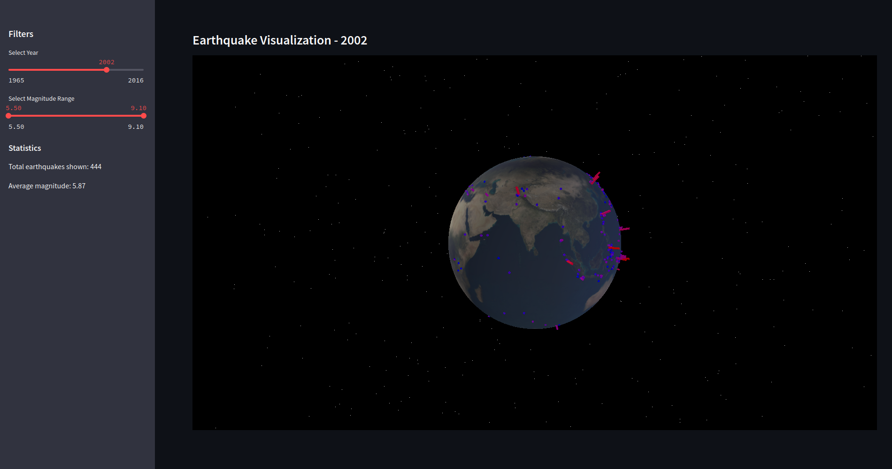

# 3D Earth Earthquake Visualization

3D visualization of global earthquake data using Python, Three.js, and Streamlit.

<p align="center">
  
</p>

## DataSet

### US Geological Survey
[Significant Earthquakes](https://www.kaggle.com/datasets/usgs/earthquake-database), 1965-2016
Date, time, and location of all earthquakes with magnitude of 5.5 or higher

Last Updated: 8 years ago (Version 1)
About this Dataset
Context

The National Earthquake Information Center (NEIC) determines the location and size of all significant earthquakes that occur worldwide and disseminates this information immediately to national and international agencies, scientists, critical facilities, and the general public. The NEIC compiles and provides to scientists and to the public an extensive seismic database that serves as a foundation for scientific research through the operation of modern digital national and global seismograph networks and cooperative international agreements. The NEIC is the national data center and archive for earthquake information.
Content

This dataset includes a record of the date, time, location, depth, magnitude, and source of every earthquake with a reported magnitude 5.5 or higher since 1965.

## Features

- **Interactive 3D Earth**: Fully rotatable and zoomable globe visualization
- **Real-time Data Rendering**: Smooth visualization of earthquake events
- **Time-based Filtering**: Filter earthquakes by year
- **Magnitude Filtering**: Focus on specific earthquake magnitudes
- **Dynamic Statistics**: Real-time statistics updates
- **Visual Indicators**: Color-coded earthquakes based on magnitude
- **Responsive Design**: Adapts to different screen sizes

## Quick Start

1. **Clone the Repository**
   ```bash
   git clone [your-repository-url]
   cd earthquake-visualization-3d
   ```

2. **Install Dependencies**
   ```bash
   pip install -r requirements.txt
   ```

3. **Run the Application**
   ```bash
   streamlit run main.py
   ```

4. **Access the Visualization**
   - Open your browser
   - Navigate to http://localhost:5000

## Usage Guide

### Sidebar Controls
- **Year Selection**: Choose specific years to visualize
- **Magnitude Range**: Filter earthquakes by magnitude
- **Statistics Panel**: View real-time data statistics

### Visualization Controls
- **Rotate**: Click and drag
- **Zoom**: Scroll wheel
- **Reset View**: Double click

## Technical Stack

- **Frontend**: Three.js for 3D rendering
- **Backend**: Python with Streamlit
- **Data Processing**: Pandas, NumPy
- **Visualization**: PyDeck, Three.js


## 📄 License

MIT License 
